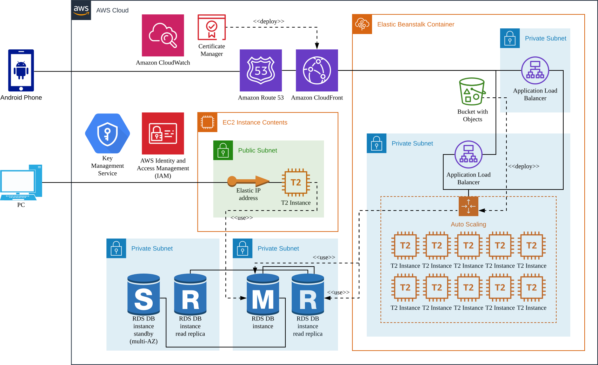

# Cycling Supporter AWS

> Full-stack cycling navigation platform with an Android client, a Java backend, and an AWS deployment architecture.

## Overview

Cycling Supporter AWS is an end-to-end service project that combines a native Android application, a Java web backend, and a cloud deployment architecture for route-based cycling support.

The project was built to connect mobile experience, backend processing, and cloud delivery in one coherent system. Rather than treating app development and infrastructure as separate exercises, this repository presents them as one product flow: client interaction, backend logic, deployment topology, and packaged artifacts.

## Demo

- Video demo: https://youtu.be/G39ZnHDm7jI

## Architecture

<p align="center">
  
</p>

The repository includes the architecture diagram used to explain the overall service topology and deployment structure.

## What this project covers

- A mobile client for cycling-focused navigation workflows
- A Java web backend for application-side processing
- AWS-oriented service deployment design
- Integration thinking across app, server, and infrastructure layers
- Packaged deliverables for demonstration and deployment

## Technical scope

### Android client
- Native Android application project
- Gradle-based Android Studio structure
- Mobile-side service interaction and route-oriented user flow
- TMap API integration within the application stack

### Backend
- Java servlet-based web application
- Eclipse dynamic web project structure
- Web resources, server-side logic, and deployable WAR packaging
- Tomcat-compatible deployment model

### Cloud deployment
- AWS deployment architecture for application delivery
- Infrastructure components centered on scalable service exposure and managed hosting
- Cloud distribution and certificate-based delivery setup
- Database-backed backend service topology
- Container-aware deployment thinking

## Technology stack

- Android Studio
- Java
- Servlet / JSP
- Apache Tomcat
- AWS
- Elastic Load Balancing
- Elastic Beanstalk
- RDS
- CloudFront
- ACM
- Docker
- TMap API

## Repository structure

```text
.
├── architecture.svg
├── android_app
│   ├── android_studio
│   └── app.apk
├── java_server
│   ├── eclipse
│   └── image.war
└── README.md
