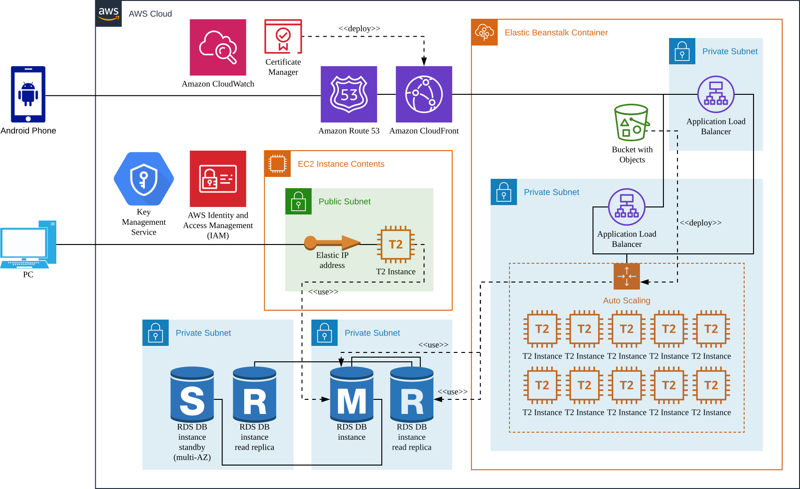
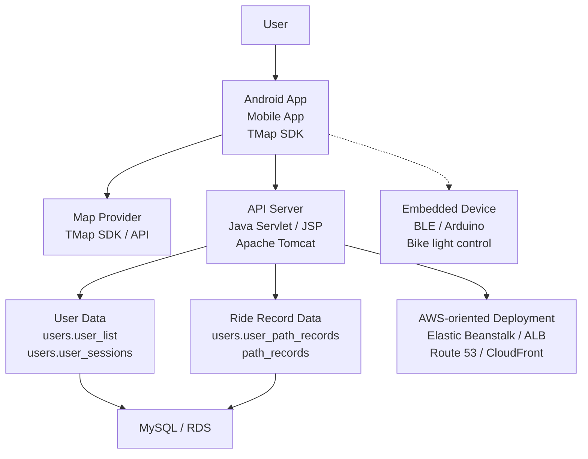
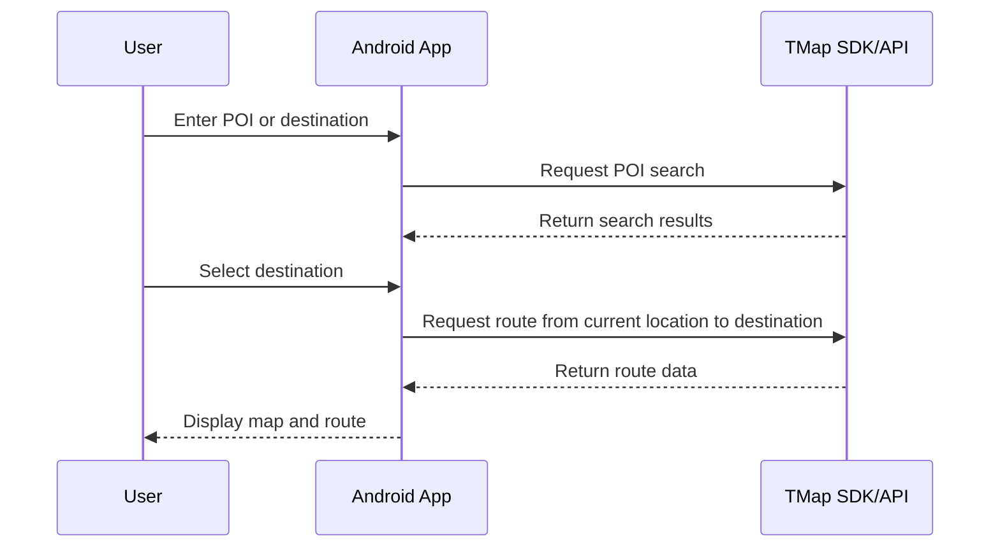
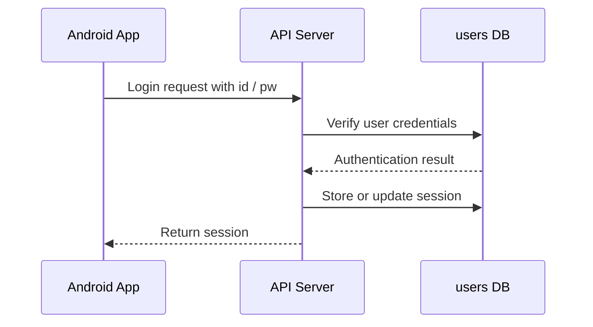
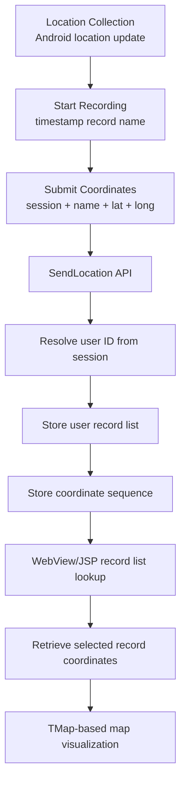
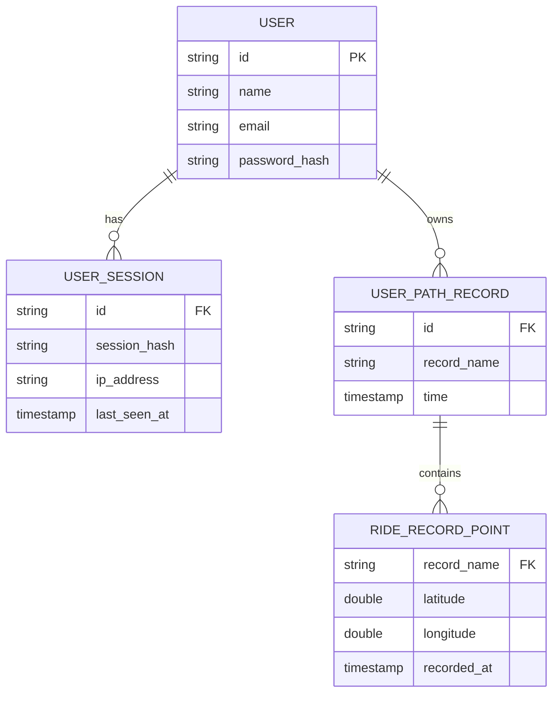

<p align="right">
  <a href="../README.md">Language</a> · <a href="README.ko.md">한국어</a> · <strong>English</strong>
</p>

# Cycling Supporter

> A full-stack cycling navigation platform connecting an Android app, a Java Servlet/JSP API server, MySQL data storage, and an AWS-oriented deployment structure

Cycling Supporter connects route search, current location display, riding status, ride record storage/retrieval, and device control scope into one cycling assistance service flow.

This repository is not only a collection of Android screens. It focuses on how user actions and location data from the mobile app continue into the API server, data storage layer, map visualization, and AWS-oriented deployment structure. Based on the portfolio material, the broader system scope also includes BLE/Arduino-based embedded device integration.

---

## Demo

- Video demo: https://youtu.be/G39ZnHDm7jI

---

## Visual Assets and Diagrams

This README uses two types of visual material.

| Type | Location | Purpose |
|---|---|---|
| `docs/assets/architecture.svg` | README body | Main visual asset for the overall service and AWS-oriented deployment structure |
| Mermaid diagrams | README body | GitHub-rendered diagrams for the app, server, data storage, and ride record flow |

<p align="center">
  
</p>

---

## What This Project Demonstrates

The main value of Cycling Supporter is not a specific algorithmic performance claim, but the structure that connects different technical layers into one service flow.

- The Android app acts as the center of user interaction and location collection.
- The API server handles authentication, sessions, user information lookup, and ride record storage/retrieval requests.
- The MySQL data storage layer manages users, sessions, ride record lists, and ride coordinate data.
- Saved ride records are visualized again through WebView/JSP and TMap-based map screens.
- The AWS-oriented deployment structure places the app, server, and data storage layer into an externally accessible service shape.
- The broader portfolio system scope includes BLE/Arduino-based device control design.

---

## Overall Service Structure



---

## Core Feature Flows

### 1. Route Search

The user searches for a POI in the Android app, selects a destination from TMap search results, and the app displays the route between the current location and the destination on the map.



### 2. Login and Sessions

After a successful login, the server issues a session value, and the app includes the session in later requests. The server resolves the session into a user ID for user information lookup and ride record storage.



### 3. Ride Record Storage and Retrieval

Ride record handling is the core end-to-end flow of this project. Coordinates collected by the app pass through the server and database and are later returned to the user as map visualization.



---

## Data Model Summary

The current implementation separates the `users` area from the `path_records` area.



`RIDE_RECORD_POINT` is a documentation-level logical entity. The actual implementation is closer to a `path_records.<record_name>` record unit.

For long-term operation, a normalized `rides` / `ride_points` model would be more stable.

---

## Implementation Scope

| Category | Scope |
|---|---|
| Repository-confirmed scope | Android app, Java/Tomcat API server, user/session/ride record data flow, AWS-oriented deployment structure |
| Portfolio-confirmed scope | BLE/Arduino-based embedded device integration, bike light control design, overall system structure |
| Modernization direction | JSON API separation, data model normalization, Android modernization, configuration/secret management, IaC, embedded protocol definition |

---

## Technology Stack

| Area | Technologies |
|---|---|
| Mobile | Android, Java, TMap SDK/API, Google Fused Location API, Volley, WebView |
| Backend | Java Servlet, JSP, Apache Tomcat, JDBC |
| Data | MySQL, user/session/ride record data flow |
| Deployment | AWS-oriented deployment, Elastic Beanstalk, RDS, Route 53, CloudFront, ALB |
| Embedded scope | BLE, Arduino, bike light control design |

---

## Repository Structure

```text
Cycling-Supporter-AWS/
  README.md
  docs/
    README.ko.md
    README.en.md
    assets/
      architecture.svg
  android/
    android-studio/
    app.apk
  tomcat/
    eclipse/
    server.war
```

---

## Running and Reviewing

### Android App

```text
android/android-studio/
```

1. Open `android/android-studio` in Android Studio.
2. Sync Gradle dependencies.
3. Check environment-specific values such as `API_BASE_URL` and `TMAP_APP_KEY`.
4. Run the app on an emulator or Android device.

### Java/Tomcat Server

```text
tomcat/eclipse/
tomcat/server.war
```

1. Import `tomcat/eclipse` into Eclipse as a Dynamic Web Project.
2. Configure Apache Tomcat.
3. Separate DB connection values and external API settings by environment.
4. Deploy the server application to Tomcat.

---

## Operational Improvement Areas

The current structure is a portfolio-oriented full-stack implementation that connects the app, server, database, deployment, and device integration scope. To extend it into an operational service structure, the following improvements are important.

- Separate external API keys and DB credentials from code, and revoke/rotate any exposed values.
- Define session expiration, renewal, revocation, and multi-device behavior clearly.
- Replace mixed plain text / JSON / HTML responses with a clearer JSON-centered API contract.
- Normalize the record-name-based coordinate storage model into `rides` / `ride_points`.
- Replace WebView/JSP-based record retrieval with Android native UI and JSON APIs.
- Stabilize ride record submission with foreground service, offline queue, retry, and batch upload.
- Improve AWS reproducibility with IaC, CI/CD, monitoring, backup, and rollback policy.
- Define embedded device integration through command protocol, pairing, safe state, and firmware state machine.

---

## License

This repository includes materials for project and portfolio presentation. Review the repository license and included artifacts before reuse or redistribution.
