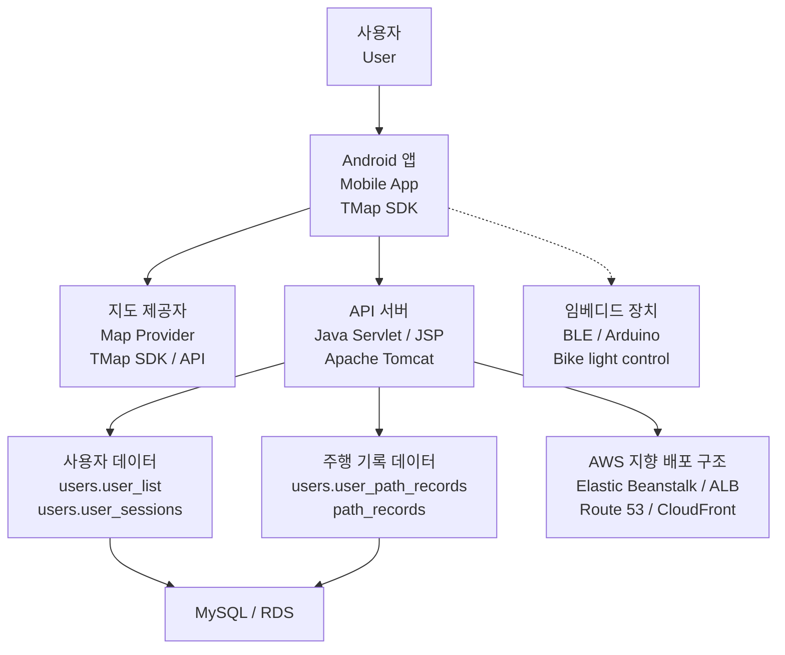
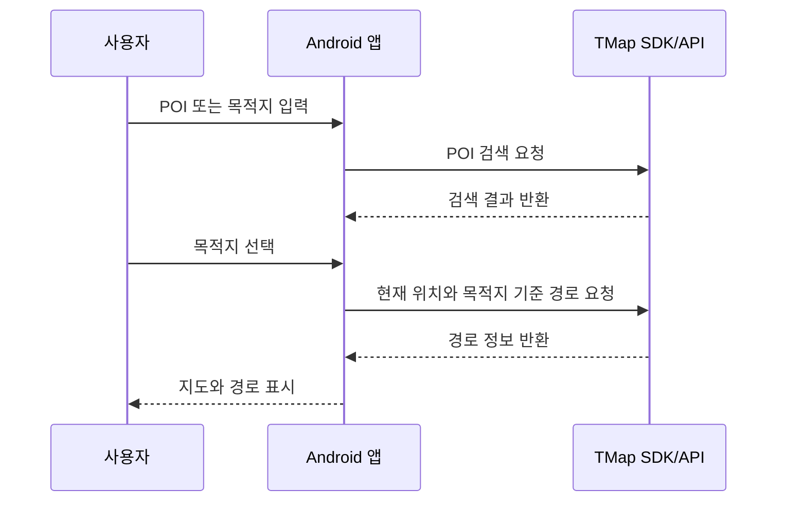
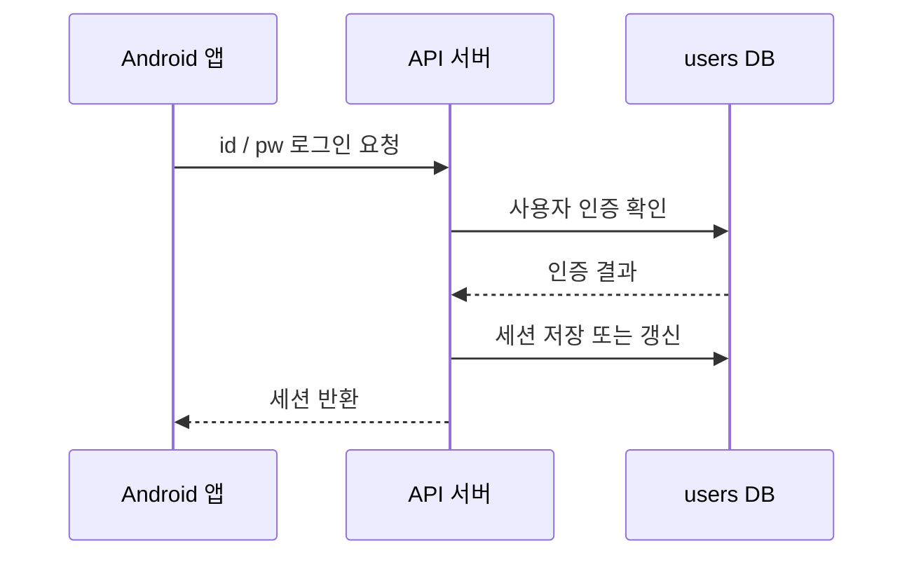
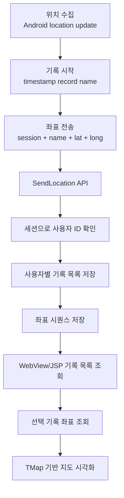
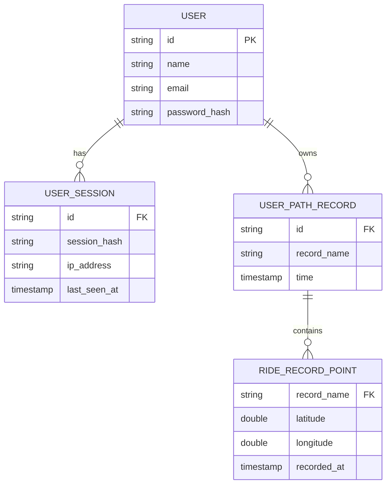

<p align="right">
  <a href="../README.md">언어 선택</a> · <strong>한국어</strong> · <a href="README.en.md">English</a>
</p>

# Cycling Supporter

> Android 앱, Java Servlet/JSP API 서버, MySQL 데이터 저장소, AWS 지향 배포 구조를 연결한 풀스택 자전거 네비게이션 플랫폼

Cycling Supporter는 자전거 주행 중 필요한 경로 탐색, 현재 위치 확인, 주행 상태 표시, 주행 기록 저장·조회, 장치 제어 범위를 하나의 서비스 흐름으로 연결한 프로젝트입니다.

이 저장소는 단순한 Android 화면 구현만을 보여주는 것이 아니라, 모바일 앱에서 발생한 사용자 조작과 위치 데이터가 API 서버, 데이터 저장소, 지도 시각화, AWS 지향 배포 구조까지 이어지는 흐름을 보여주는 데 초점을 둡니다. 포트폴리오 자료 기준으로는 BLE/Arduino 기반 임베디드 장치 연동 범위도 함께 다룹니다.

---

## 데모

- Video demo: https://youtu.be/G39ZnHDm7jI

---

## 시각 자료와 다이어그램 구성

| 구분 | 사용 위치 | 역할 |
|---|---|---|
| `docs/assets/architecture.svg` | README 본문 | 전체 서비스와 AWS 지향 배포 구조를 한눈에 보여주는 대표 이미지 |
| Mermaid diagram | README 본문 | 앱, 서버, 데이터 저장소, 주행 기록 흐름을 GitHub에서 바로 확인할 수 있는 구조도 |

<p align="center">
  
</p>

---

## 프로젝트가 보여주는 것

Cycling Supporter의 핵심은 특정 알고리즘 성능이 아니라, 서로 다른 기술 계층을 하나의 서비스 흐름으로 연결하는 구조입니다.

- Android 앱이 사용자 인터페이스와 위치 수집의 중심이 됩니다.
- API 서버가 인증, 세션, 사용자 정보 조회, 주행 기록 저장·조회 요청을 처리합니다.
- MySQL 데이터 저장소가 사용자 정보, 세션, 주행 기록 목록, 주행 좌표 데이터를 관리합니다.
- 저장된 주행 기록은 WebView/JSP와 TMap 기반 지도 화면에서 다시 시각화됩니다.
- AWS 지향 배포 구조는 앱, 서버, 데이터 저장소를 외부 접근 가능한 서비스 형태로 배치합니다.
- 포트폴리오 자료의 전체 시스템 범위에서는 BLE/Arduino 기반 장치 제어 설계도 포함됩니다.

---

## 전체 서비스 구조



---

## 핵심 기능 흐름

### 1. 경로 탐색

사용자는 Android 앱에서 POI를 검색하고, TMap 기반 검색 결과 중 목적지를 선택합니다. 앱은 현재 위치와 목적지 사이의 경로를 지도 위에 표시합니다.



### 2. 로그인과 세션

로그인 성공 시 서버는 세션 값을 발급하고, 앱은 이후 요청에 세션을 포함합니다. 서버는 세션을 사용자 ID로 변환해 사용자 정보 조회와 주행 기록 저장 흐름에 사용합니다.



### 3. 주행 기록 저장과 조회

주행 기록 기능은 이 프로젝트의 핵심 end-to-end 흐름입니다. 앱에서 수집한 좌표가 서버와 DB를 거쳐 다시 지도 시각화로 돌아옵니다.



---

## 데이터 모델 요약

현재 구현은 `users` 영역과 `path_records` 영역을 나누어 사용합니다.



`RIDE_RECORD_POINT`는 문서상 논리 엔티티입니다. 실제 구현은 `path_records.<record_name>` 형태의 기록 단위에 가깝습니다.

장기 운영을 고려한다면 `rides` / `ride_points` 중심의 정규화 모델이 더 안정적입니다.

---

## 구현 범위

| 구분 | 범위 |
|---|---|
| 저장소 코드 확인 범위 | Android 앱, Java/Tomcat API 서버, 사용자·세션·주행 기록 데이터 흐름, AWS 지향 배포 구조 |
| 포트폴리오 자료 확인 범위 | BLE/Arduino 기반 임베디드 장치 연동, 자전거 조명 제어 설계, 전체 시스템 구성 |
| 현대화 방향 | JSON API 분리, 데이터 모델 정규화, Android 최신화, 설정/secret 관리, IaC, 임베디드 protocol 상세화 |

---

## 기술 스택

| 영역 | 기술 |
|---|---|
| Mobile | Android, Java, TMap SDK/API, Google Fused Location API, Volley, WebView |
| Backend | Java Servlet, JSP, Apache Tomcat, JDBC |
| Data | MySQL, 사용자/세션/주행 기록 데이터 흐름 |
| Deployment | AWS 지향 배포 구조, Elastic Beanstalk, RDS, Route 53, CloudFront, ALB |
| Embedded scope | BLE, Arduino, bike light control design |

---

## 저장소 구조

```text
Cycling-Supporter-AWS/
  README.md
  docs/
    README.ko.md
    README.en.md
    assets/
      architecture.svg
  android/
    android-studio/
    app.apk
  tomcat/
    eclipse/
    server.war
```

---

## 실행 및 검토 방법

### Android 앱

```text
android/android-studio/
```

1. Android Studio에서 `android/android-studio`를 엽니다.
2. Gradle 동기화를 수행합니다.
3. `API_BASE_URL`, `TMAP_APP_KEY` 등 환경별 설정을 확인합니다.
4. emulator 또는 Android device에서 앱을 실행합니다.

### Java/Tomcat 서버

```text
tomcat/eclipse/
tomcat/server.war
```

1. Eclipse에서 `tomcat/eclipse`를 Dynamic Web Project로 가져옵니다.
2. Apache Tomcat 실행 환경을 구성합니다.
3. DB 연결 정보와 외부 API 설정을 환경에 맞게 분리합니다.
4. Tomcat에 서버 애플리케이션을 배포합니다.

---

## 운영 관점의 개선 방향

현재 구조는 포트폴리오형 풀스택 구현으로서 앱, 서버, DB, 배포, 장치 연동 범위를 연결합니다. 운영 가능한 서비스 구조로 확장하려면 다음 개선이 필요합니다.

- 외부 API key와 DB credential을 코드에서 분리하고, 노출된 값은 폐기·교체합니다.
- 세션 만료, 갱신, 폐기, 다중 기기 처리를 명확히 합니다.
- plain text / JSON / HTML 응답을 JSON 중심 API 계약으로 정리합니다.
- 기록명 기반 좌표 저장 구조를 `rides` / `ride_points` 모델로 정규화합니다.
- WebView/JSP 기반 기록 조회를 Android native UI와 JSON API로 전환합니다.
- 주행 기록 전송은 foreground service, offline queue, retry, batch upload 구조로 안정화할 수 있습니다.
- AWS 배포 구조는 IaC, CI/CD, monitoring, backup, rollback 정책으로 재현성을 높일 수 있습니다.
- 임베디드 장치 연동은 command protocol, pairing, safe state, firmware state machine을 명확히 해야 합니다.

---

## 라이선스

이 저장소는 프로젝트 및 포트폴리오 설명을 위한 자료를 포함합니다. 재사용 또는 재배포 전 저장소의 라이선스와 포함 산출물을 확인하세요.
